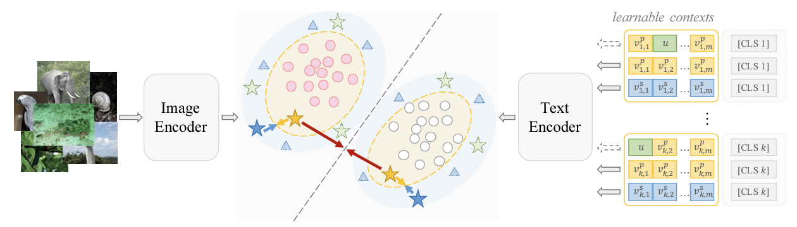
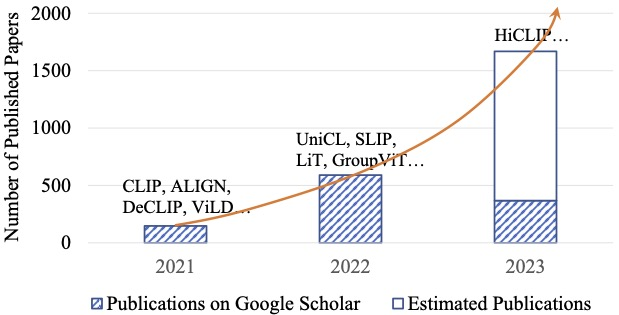
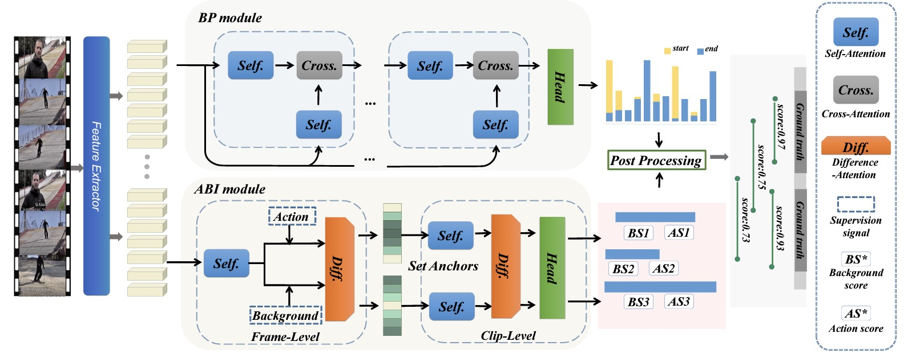
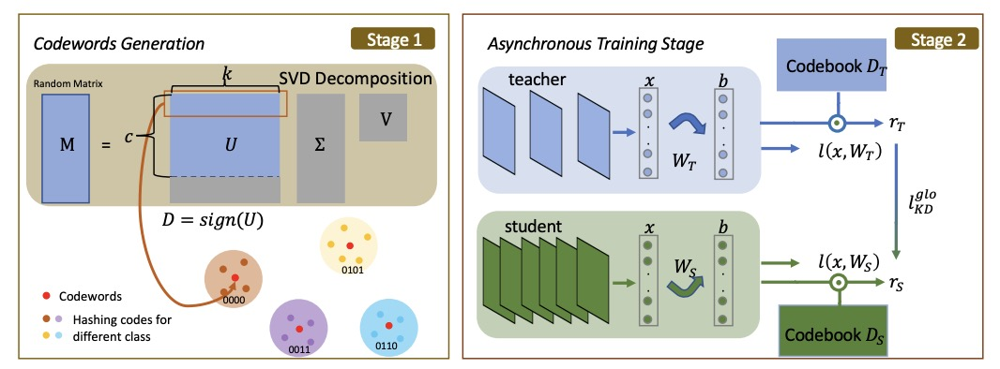
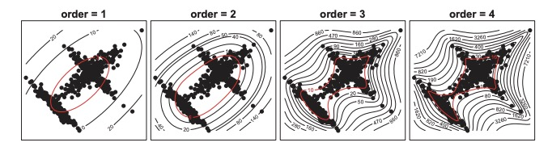
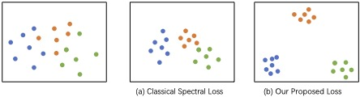
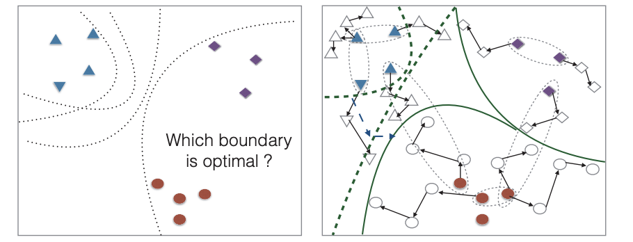
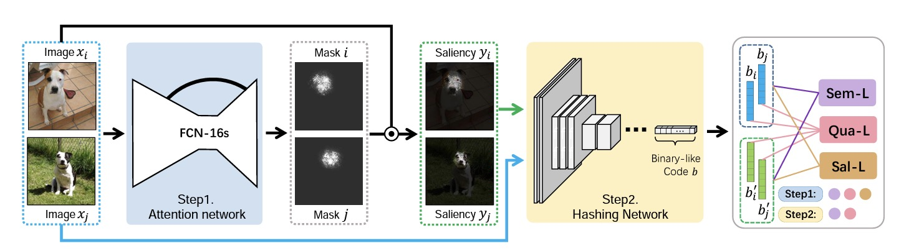








I am currently working as a research fellow at [S-Lab@NTU](https://www.ntu.edu.sg/s-lab), Nanyang Technological University, under the supervision of [Prof. Shijian Lu](https://personal.ntu.edu.sg/shijian.lu/). Prior to this, I served as a senior research scientist (2021-2023) at CityBrain Lab, DAMO, Alibaba Group, under the supervision of [Prof. Jieping Ye](http://www.yelabs.net/).
I completed my Ph.D. degree (2016-2021) at the [VILab](https://vilab.hit.edu.cn/) of Harbin Institute of Technology, under the guidance of [Prof. Hongxun Yao](http://homepage.hit.edu.cn/yaohongxun). During my Ph.D. study, I interned at CityBrain Lab, DAMO, Alibaba Group, supervised by [Prof. Xian-sheng Hua](https://scholar.google.com/citations?user=6G-l4o0AAAAJ&hl=zh-CN).
During my Phd period, my research interests include computer vision and deep learning with a focus on image retrieval and quantization. Now I am interested in open vocabulary tasks.

# 🔥 News
- *2023.10*: &nbsp;🎉🎉 One paper is accepted by NIPS 2023! 
- *2023.07*: &nbsp;🎉🎉 Two papers are accepted by ICCV 2023!  
- *2021*: &nbsp;🎉🎉 One paper is accepted by AAAI 2022!
- *2021*: &nbsp;🎉🎉 One paper is accepted by TIP 2022!
- *2020*: &nbsp;🎉🎉 Two papers are accepted by AAAI 2021!
- *2020*: &nbsp;🎉🎉 One paper is accepted by TIP 2021!
- *2019*: &nbsp;🎉🎉 One paper is accepted by AAAI 2020!
# 📝 Publications 
[//]: # (----------- NIPS 2023 -------------------------)

NIPS 2023

[Category-Extensible Out-of-Distribution Detection via Hierarchical Context Descriptions](https://openreview.net/pdf?id=SA2KrosYjY )

[//]: # (<strong></strong>)

Kai Liu, Zhihang Fu, Chao Chen, **Sheng Jin**, Ze Chen, Mingyuan Tao, Rongxin Jiang, Jieping Ye

<i>NIPS, 2023</i>

<a href="https://openreview.net/pdf?id=SA2KrosYjY">paper</a> 

[//]: # (----------- Preprint -------------------------)

Preprint

[Vision-Language Models for Vision Tasks: A Survey](https://arxiv.org/pdf/2304.00685) 

[//]: # (<strong></strong>)

Jingyi Zhang, Jiaxing Huang, **Sheng Jin**, Shijian Lu

<i>Arxiv</i>

<a href="https://arxiv.org/pdf/2304.00685">paper</a> 

[//]: # (----------- ICCV 2023 -------------------------)

ICCV 2023

[Uncertainty-aware Unsupervised Multi-Object Tracking](https://openaccess.thecvf.com/content/ICCV2023/papers/Liu_Uncertainty-aware_Unsupervised_Multi-Object_Tracking_ICCV_2023_paper.pdf) 

[//]: # (<strong></strong>)

Kai Liu, **Sheng Jin**, Zhihang Fu, Ze Chen, Rongxin Jiang, Jieping Ye

<i>ICCV, 2023</i>

<a href="https://openaccess.thecvf.com/content/ICCV2023/papers/Liu_Uncertainty-aware_Unsupervised_Multi-Object_Tracking_ICCV_2023_paper.pdf">paper</a> 

[//]: # (----------- ICCV 2023 -------------------------)

ICCV 2023

[Domain Generalization via Balancing Training Difficulty and Model Capability](https://arxiv.org/pdf/2309.00844.pdf) 

[//]: # (<strong></strong>)

Xueying Jiang, Jiaxing Huang, **Sheng Jin**, Shijian Lu

<i>ICCV, 2023</i>

<a href="https://arxiv.org/pdf/2309.00844.pdf">paper</a> 

[//]: # (----------- AAAI 2022 -------------------------)

AAAI 2022

[Temporal Action Proposal Generation with Background Constraint](https://ojs.aaai.org/index.php/AAAI/article/view/20212)

[//]: # (<strong></strong>)

Haosen Yang, Wenhao Wu, Lining Wang, **Sheng Jin**, Boyang Xia, Hongxun Yao, Hujie Huang

<i>AAAI, 2022</i>

<a href="https://arxiv.org/pdf/2309.00844.pdf">paper</a> 

[//]: # (----------- AAAI 2021 -------------------------)

AAAI 2021

[Asynchronous teacher guided bit-wise hard mining for online hashing](https://ojs.aaai.org/index.php/AAAI/article/view/16265)

[//]: # (<strong></strong>)

**Sheng Jin**, Qin Zhou, Hongxun Yao, Yao Liu, Xian-Sheng Hua

<i>AAAI, 2021</i>

<a href="https://ojs.aaai.org/index.php/AAAI/article/view/16265">paper</a> 

[//]: # (----------- AAAI 2021 -------------------------)

AAAI 2021

[Homm: Higher-order moment matching for unsupervised domain adaptation](https://ojs.aaai.org/index.php/AAAI/article/download/5745/5601)

[//]: # (<strong></strong>)

Chao Chen, Zhihang Fu, Zhihong Chen, **Sheng Jin**, Zhaowei Cheng, Xinyu Jin, Xian-Sheng Hua

<i>AAAI, 2021</i>

<a href="https://ojs.aaai.org/index.php/AAAI/article/download/5745/5601">paper</a> 

[//]: # (----------- TIP 2021 -------------------------)

TIP 2021

[Unsupervised discrete hashing with affinity similarity](https://ieeexplore.ieee.org/abstract/document/9467816/)

[//]: # (<strong></strong>)

**Sheng Jin**, Hongxun Yao, Qin Zhou, Yao Liu, Jianqiang Huang, Xiansheng Hua

<i>TIP, 2021</i>

<a href="https://ieeexplore.ieee.org/abstract/document/9467816/">paper</a> 

[//]: # (----------- AAAI 2020 -------------------------)

AAAI 2020

[SSAH: Semi-Supervised Adversarial Deep Hashing with Self-Paced Hard Sample Generation](https://ojs.aaai.org/index.php/AAAI/article/download/6773/6627)

[//]: # (<strong></strong>)

**Sheng Jin**, Shangchen Zhou, Yao Liu, Chao Chen, Xiaoshuai Sun, Hongxun Yao, Xian-Sheng Hua

<i>AAAI, 2020</i>

<a href="https://ojs.aaai.org/index.php/AAAI/article/download/6773/6627">paper</a> 

[//]: # (----------- TIP 2020 -------------------------)

TIP 2020

[Deep saliency hashing for fine-grained retrieval](https://arxiv.org/pdf/1807.01459.pdf)

[//]: # (<strong></strong>)

**Sheng Jin**, HongxunYao, XiaoshuaiSun, ShangchenZhou, LeiZhang, XianshengHua

<i>TIP, 2020</i>

<a href="https://arxiv.org/pdf/1807.01459.pdf">paper</a> 

# 🎖 Honors and Awards
- *2022.* Excellent Doctors’ Nomination. 
- *2021.* National Scholarships

# 📖 Educations
- *2016.09 - 2021.09:* Doctor of Philosophy, School of Computer Science and Engineering, Harbin Institute of Technology
- *2012.09 - 2016.07:* Bachelor in Intelligence Science and Technology, School of Mathematics, Harbin Institute of Technology
 

# 🧑‍🔬 Service
- Reviewer of IEEE TPAMI, TCVST

# 💻 Internships
- *2018.09 - 2021.11*, Citybrain Lab, Alibaba Group, China.

**Last Update:** October 9, 2023

Thanks for the template of <a href="https://github.com/RayeRen/acad-homepage.github.io">Yi Ren</a>

